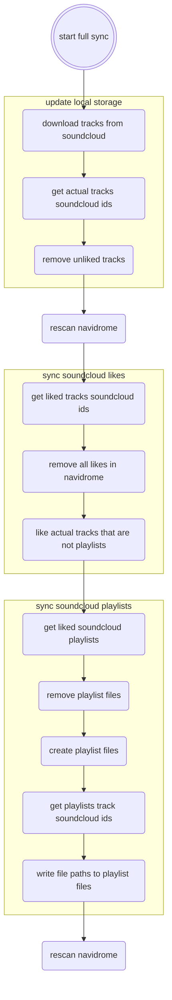

<h1 style="color:red">INDEV</h1>

# сценарий синка с soundcloud

### needed soundcloud data:
* sc tracks
* sc liked tracks metadata: id, url, title
* sc playlists metadata: id, url, title
* sc playlists tracklist ids

