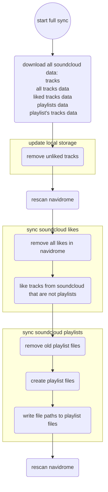

<h1 style="color:red">INDEV</h1>

# сценарий синка с soundcloud

взаимодействие с внешними сервисами, только через клиенты
nd_client.sh - клиент navidrome
sc_client.sh - клиент soundcloud
fs_client.sh - клиент файловой системы

config.sh - глобальные настройки и константы

get_sc_data.sh - скачивание и сохранение необходимых данных soundcloud
update_local_storage.sh - актуализация локального хранилища, удаление unliked треков и удаление их айди из archive.txt(кэш скачивания yt-dlp)
sync_sc_likes.sh - синхронизация лайкнутых треков: удаление всех лайков, затем проставление лайков в соответствии с данными полученными в get_sc_data.sh
sync_sc_playlists.sh - синхронизация лайкнутых плейлистов: удалениие существующих .m3u файлов, затем в цикле для каждого плейлиста создаем новый файл и добавляем пути к файлам треков, лайкнутые плейлисты и айди треков из них получены в get_sc_data.sh

full_sync.sh - скрипт вызывающий все остальные в правильной последовательности

### needed soundcloud data:
* sc tracks
* sc liked tracks metadata: id, url, title
* sc playlists metadata: id, url, title
* sc playlists tracklist ids

